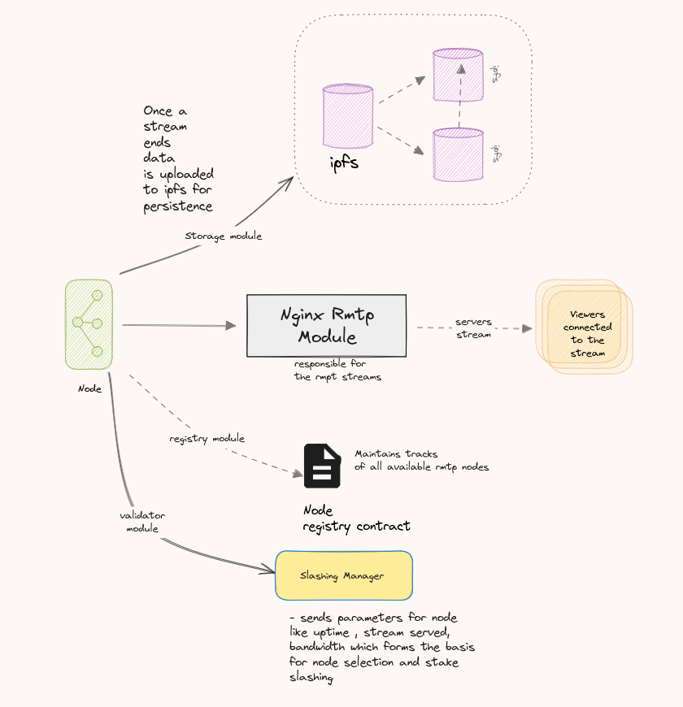

## Apt Play Node
This repository contains the code and guidlines for running an
Apt Play node and become part of the streaming network services

## Architecture
The node is designed in a modular way you can make modules of your own and plug them in the node  
**Note:** The custom modules must not create downtime in anyway possible as you might lose your stake

## Getting Started
How to become a node
**Requirements**
We recommend having the minimum to become part of the network

